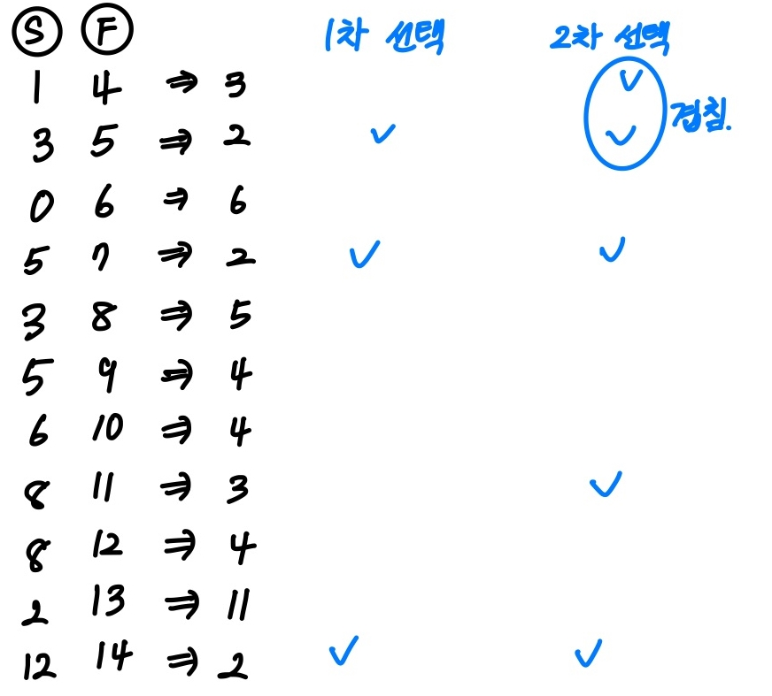
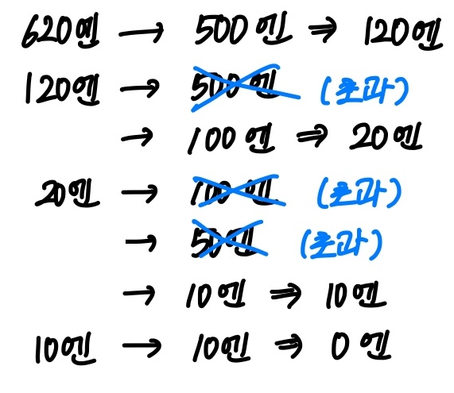
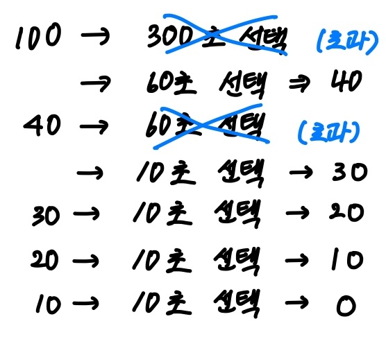
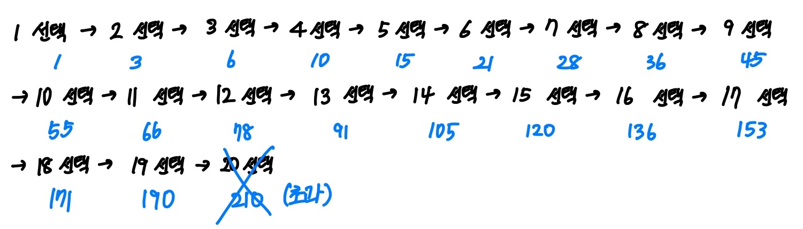
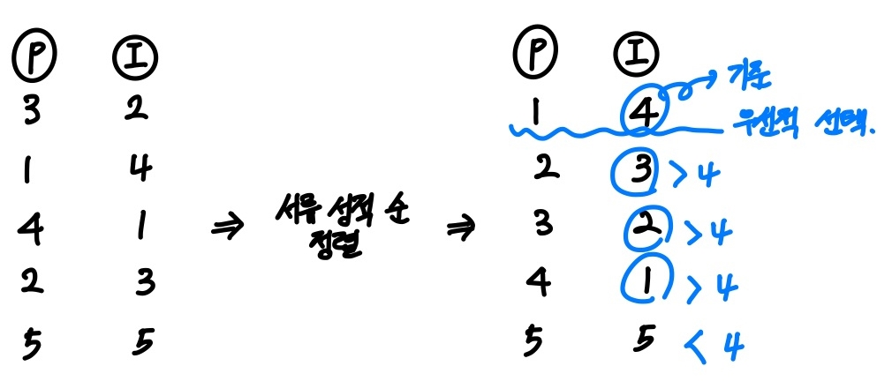
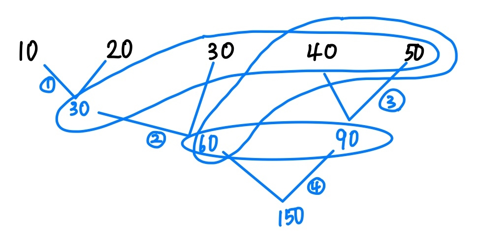
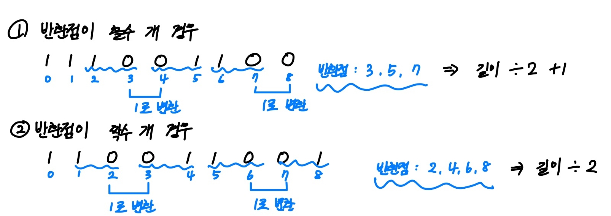

# 목차

1. [알아두어야 하는 파이썬 라이브러리](#알아두어야-하는-파이썬-라이브러리)

- [내장 함수](#내장-함수)
- [itertools 라이브러리](#itertools-라이브러리)
- [heapq 라이브러리](#heapq-라이브러리)
- [bisect 라이브러리](#bisect-라이브러리)
- [collections 라이브러리](#collections-라이브러리)
- [math 라이브러리](#math-라이브러리)

2. [그리디/탐욕 알고리즘 (Greedy Algorithm)](#그리디탐욕-알고리즘-greedy-algorithm)
3. [다이나믹 프로그래밍 알고리즘 (Dynamic Programming Algorithm)](#다이나믹-프로그래밍-알고리즘-dynamic-programming-algorithm)
4. [트리](#트리)

# 알아두어야 하는 파이썬 라이브러리

## 내장 함수

- sum() : iterable한 객체가 입력으로 주어졌을 때, 모든 원소의 합 return
  - iterable은 반복 가능한 객체
  - lsit, tuple, dictionary, set 등 해당

```
list = [10, 22, 19, 2, 9, 3]
sumList = sum(list)

print(sumList)
```

```
65
```

- max() : 파라미터가 2개 이상 들어왔을 때 가장 큰 값 return

```
list = [1, 2, 3]
print(max(list))
```

```
3
```

- min() : 파라미터가 2개 이상 들어왔을 때 가장 작은 값 return

```
list = [1, 2, 3]
print(min(list))
```

```
1
```

- eval() : 수학 수식이 문자열 형식으로 들어오면 해당 수식을 계산한 결과 return

```
result = eval("(2 + 4) * 6")
print(result)
```

```
36
```

- sort() : 리스트 객체의 내부 값이 정렬된 값으로 바로 변경

```
data = [5, 2, 1, 3, 4]
data.sort()
print(data)
```

```
[1, 2, 3, 4, 5]
```

- sorted() : iterable한 객체가 들어왔을 때, 정렬된 결과 return
  - key 속성으로 정렬 기준 설정
  - reverse 속성으로 정렬된 결과 리스트를 뒤집을지 여부 설정

```
result = sorted([('홍길동', 10), ('강낭콩', 20), ('전문가', 15)], key = lambda x: x[1], reverse = True)
print(result)
```

```
[('홍길동', 10), ('전문가', 15), ('강낭콩', 20)]
```

```
result = sorted([5, 1, 2, 3, 4]) # 오름차순으로 정렬
print(result)

result = sorted([5, 1, 2, 3, 4], reverse = True) # 내림차순으로 정렬
print(result)
```

```
[1, 2, 3, 4, 5]

[5, 4, 3, 2, 1]
```

---

## itertools 라이브러리

- 반복되는 데이터를 처리하는 기능을 포함하고 있는 라이브러리
- permutations : 순열
- combinations : 조합
- product : 중복 허용 순열
- combinations_with_replacement : 중복 허용 조합

```
from itertools import permutations, combinations, product, combinations_with_replacement

data = ['A', 'B', 'C']

result = list(permutations(data, 3)) # 모든 순열 구하기
print(result)

result = list(combinations(data, 2)) #2개를 뽑는 모든 조합 구하기
print(result)

result = list(product(data, repeat=2)) # 2개를 뽑는 모든 순열 구하기(중복 허용)
print(result)

result = list(combinations_with_replacement(data, repeat=2)) # 2개를 뽑는 모든 조합 구하기(중복 허용)
print(result)
```

```
# 3개를 뽑는 순열
[('A', 'B', 'C'), ('A', 'C', 'B'), ('B', 'A', 'C'), ('B', 'C', 'A'), ('C', 'A', 'B'), ('C', 'B', 'A')]

# 2개를 뽑는 조합
[('A', 'B'), ('A', 'C'), ('B', 'C')]

# 2개를 뽑는 중복허용 순열
[('A', 'A'), ('A', 'B'), ('A', 'C'), ('B', 'A'), ('B', 'B'), ('B', 'C'), ('C', 'A'), ('C', 'B'), ('C', 'C')]

# 2개를 뽑는 중복허용 조합
[('A', 'A'), ('A', 'B'), ('A', 'C'), ('B', 'B'), ('B', 'C'), ('C', 'C')]
```

## heapq 라이브러리

- heap 기능
- 다익스트라 최단 경로 알고리즘, 우선순위 큐 기능에서 유용
- heapq 라이브러리
  - module import
    ```
    import heapq
    ```
  - 리스트를 heap으로 변환
    ```
    List = [4, 1, 3, 5, 2]
    heapq.heapify(List)
    print(List)
    ```
    ```
    [1, 2, 3, 4, 5]
    ```
  - 원소 추가
    ```
    arr = []
    heapq.heappush(arr, 2)
    heapq.heappush(arr, 1)
    heapq.heappush(arr, 4)
    heapq.heappush(arr, 3)
    print(arr)
    ```
    ```
    [1, 2, 3, 4]
    ```
  - 원소 삭제
    ```
    print(arr.heappop(heap))
    print(arr)
    ```
    ```
    1
    [2, 3, 4]
    ```

## bisect 라이브러리

- 이진 탐색을 쉽게 구현할 수 있도록 해주는 라이브러리
- 정렬된 배열에서 특정한 원소를 찾아야 할 때 효과적
- bisect_left(a, x) : 정렬된 순서를 유지하면서 리스트 a에 데이터 x를 삽입할 가장 왼쪽 인덱스를 찾는 메서드
- bisect_right(a, x) : 정렬된 순서를 유지하면서 리스트 a에 데이터 x를 삽입할 가장 오른쪽 인덱스를 찾는 메서드

```
from bisect import bisect_left, bisect_right

a = [1, 2, 4, 4, 8]
x = 4

print(bisect_left(a, x))
print(bisect_right(a, x))
```

```
2
4
```

## collections 라이브러리

- deque

  - 보통 큐를 구현할 때 이용
  - deque는 리스트와 다르게 인덱싱, 슬라이싱 기능은 없지만, 연속적으로 나열된 데이터의 시작 부분이나 끝부분에 데이터를 삽입하거나 삭제할 때는 매우 효과적
  - deque

    - module import

    ```
    from collections import deque
    ```

    - 원소 추가

    ```
    data = deque([2, 3, 4])
    data.appendleft(1)
    data.append(5)

    print(list(data))
    ```

    ```
    [1, 2, 3, 4, 5]
    ```

    - 원소 삭제

    ```
    data.popleft()
    data.pop()

    print(list(data))
    ```

    ```
    [2, 3, 4]
    ```

- Counter : 등장 횟수를 세는 기능

```
from collections import Counter

counter = Counter(['red', 'blue', 'red' ,'green', 'blue', 'blue'])
print(counter['red'])
print(counter['blue'])
```

```
2
3
```

## math 라이브러리

- 자주 사용되는 수학적인 기능을 포함하고 있는 라이브러리
- factorial(n) : n!
- sqrt(x) : x의 제곱근
- gcd(a, b) : a와 b의 최대 공약수
- lcm(a, b) : a와 b의 최소 공배수
- pi : 상수 파이(pi)
- e : 자연상수 e

```
import math

print(math.factorial(5))

print(math.sqrt(9))

print(math.gcd(35, 14))

print(math.lcm(10, 5))

print(math.pi)

print(math.e)
```

```
120

3

7

10

3.14159...

2.718...
```

---

# 그리디/탐욕 알고리즘 (Greedy Algorithm)

## 이론

- 선택의 순간인 각 단계에서 찾을 수 있는 가장 최적의 방법 선택
- 지금의 선택이 앞으로 남은 선택들에 어떠한 영향을 끼치는지 고려하지 않음
- 알고리즘의 결과가 최적임을 알리는 것을 정당성 증명
- 선택마다의 값은 그 순간에서 최적(지역적 최적)일수 있지만, 그 선택들을 반복하여 수집하였다고 해도 최종적인 정답(전역적인 정답)을 만들었다는 보장 없음
- 그러나 그리디 알고리즘을 적용할 수 있는 문제들은 최적이면서 전역적으로 최적인 문제들

## 알고리즘 적용 조건

1. 탐욕적 선택 속성(Greedy Choice Property) : 앞의 선택이 이후의 선택에 영향을 주지 않음
2. 최적 부분 구조(Optimal Substructure) : 문제에 대한 최종 해결 방법은 부분 문제에 대한 최적 문제 해결 방법으로 구성

## 해결 방법

1. 선택 절차(Selection Procedure) : 현재 상태에서의 최적의 해답을 선택
2. 적절성 검사(Feasibility Check) : 선택된 해가 문제의 조건을 만족하는지 검사
3. 해답 검사(Solution Check): 원래의 문제가 해결되었는지 검사하고, 해결되지 않았다면 선택 절차로 돌아가 위의 과정을 반복

## 문제

<BOJ 2839> 설탕 배달

**해결 방법 적용**

- 선택 절차 : 설탕 봉지 개수를 줄이기 위해 현재 가장 담을 무게가 높은 5kg 봉지 우선적 선택
- 적절성 검사
  - 1번 과정을 통해 선택된 봉지들의 무게 합이 총 무게를 초과하는지 검사
  - 초과하면 가장 마지막에 선택한 봉지를 삭제하고, 1번으로 돌아가 한 단계 작은 봉지인 3kg를 선택
- 해답 검사
  - 선택된 봉지들의 무게 합이 총 무게와 일치하는지 검사
  - 총 무게보다 작다면 1번 과정부터 다시 반복

**예제 입력**

18 -> (5kg) -> 13kg -> (5kg) -> 8kg -> (5kg) -> 3kg -> (3kg) -> 0kg

**예제 출력**

5kg 봉지 3개, 3kg 봉지 1개 => 4개

---

<BOJ 11399> ATM

**해결 방법 적용**

- 선택 절차 : 모든 사람이 인출하는데 필요한 최소 시간을 구하기 위해 현재 가장 적은 인출 시간을 가진 사람부터 우선적으로 돈 인출
- 적절성 검사 : 1번 과정을 통해 선택된 봉지들의 무게 합이 제일 적은 인출 시간인지 검사
- 해답 검사
  - 선택된 사람들의 인출 시간의 합이 제일 적은 인출 시간과 일치하는지 검사
  - 총 무게보다 크다면 1번 과정부터 다시 반복

**예제 입력**

3 1 4 3 2
1t (1) -> 2t (1+2) -> 3t (1+2+3) -> 3t (1+2+3+3) -> 4 (1+2+3+3+4)

**예제 출력**

(1) + (1+2) + (1+2+3) + (1+2+3+3) + (1+2+3+3+4) = 32t

---

<BOJ 11047> 동전 0

**해결 방법 적용**

- 선택 절차 : 동전 개수를 줄이기 위해 현재 가장 가치가 높은 동전 우선적 선택
- 적절성 검사
  - 1번 과정을 통해 선택된 동전들의 합이 주어진 금액을 초과하는지 검사
  - 초과하면 가장 마지막에 선택한 동전을 삭제하고, 1번으로 돌아가 한 단계 작은 동전을 선택
- 해답 검사
  - 선택된 동전들의 합이 주어진 금액과 일치하는지 검사
  - 액수가 부족하면 1번 과정부터 다시 반복

**예제 입력**

4200


**예제 출력**

1000 4개, 100 2개 => 6개

---

<BOJ 1931> 회의실 배정

**해결 방법 적용**

- 선택 절차 : 회의실을 사용할 수 있는 회의의 최대 개수를 늘리기 위해 현재 가장 짧게 끝나는 회의 우선적 선택
- 적절성 검사
  - 1번 과정을 통해 선택된 회의의 시간이 이전 회의와 겹치는지 검사
  - 겹친다면 가장 마지막에 선택한 회의를 삭제하고, 1번으로 돌아가 그 다음 짧은 회의를 선택
- 해답 검사
  - 선택된 회의들의 개수가 제일 최대인지 검사
  - 최대가 아니라면 1번 과정부터 다시 반복

**예제 입력**



1차 선택 : 회의가 가장 짧게 끝나는 시간들을 우선적 선택, 회의들끼리 서로 겹치는 시간 없음, 선택된 회의들의 개수가 제일 최대가 아님
2차 선택 : 회의가 가장 짧게 끝나느 시간들을 우선적 선택, (1 4)와 (3 5)가 겹침 나머지는 겹치지 않음, 선택된 회의들의 개수가 제일 최대임

**예제 출력**

(1 4) (5 7) (8 11) (12 14) => 4개

---

<BOJ 5585> 거스름돈

**해결 방법 적용**

- 선택 절차 : 거스름돈의 동전 개수를 줄이기 위해 현재 가장 가치가 높은 동전 우선적 선택
- 적절성 검사
  - 1번 과정을 통해 선택된 동전들의 합이 거슬러 줄 금액을 초과하는지 검사
  - 초과하면 가장 마지막에 선택한 동전을 삭제하고, 1번으로 돌아가 한 단계 작은 동전을 선택
- 해답 검사
  - 선택된 동전들의 합이 거슬러 줄 금액과 일치하는지 검사
  - 액수가 부족하면 1번 과정부터 다시 반복

**예제 입력**



**예제 출력**

500엔, 100엔, 10엔, 10엔 => 4개

---

<BOJ 10162> 전자레인지

**해결 방법 적용**

- 선택 절차 : 전자레인지 요리 버튼 횟수를 줄이기 위해 현재 가장 긴 시간 동안 작동하는 버튼을 선택
- 적절성 검사
  - 1번 과정을 통해 선택된 시간들의 합이 요리해야 할 시간을 초과하는지 검사
  - 초과하면 가장 마지막에 선택한 버튼을 삭제하고, 1번으로 돌아가 한 단계 짧은 시간 버튼을 선택
- 해답 검사
  - 선택된 버튼들의 합이 요리해야 할 시간과 일치하는지 검사
  - 시간이 부족하면 1번 과정부터 다시 반복

**예제 입력**



**예제 출력**

A 0번 B 1번, C 4번

---

<BOJ 1789> 수들의 합

**해결 방법 적용**

- 선택 절차 : 자연수 N의 최댓값을 구하기 위해 제일 작은 숫자를 선택
- 적절성 검사
  - 1번 과정을 통해 선택된 숫자들의 합이 N을 초과하는지 검사
  - 초과하면 가장 마지막에 선택한 버튼을 삭제하고, 1번으로 돌아가 한 단계 작은 숫자를 선택
- 해답 검사
  - 선택된 숫자들의 합이 자연수 N과 일치하는지 검사
  - 숫자가 작다면 1번 과정부터 다시 반복

**예제 입력**

100



**예제 출력**

19

---

<BOJ 1789> 신입 사원

**해결 방법 적용**

우선 성적을 '서류 성적 순'으로 정렬

- 선택 절차 : 최대 인원 수를 구하기 위해 가장 면접 점수가 높은 사람을 선택
- 적절성 검사
  - 1번 과정을 통해 선택된 사람이 다른 사람의 면접 점수보다 낮은 사람이 존재하는지 검사
  - 존재하면 가장 마지막에 선택한 사람 선택 취소
- 해답 검사 : 선발된 인원 수가 최대 인원 수인지 검사

**예제 입력**



**예제 출력**

4

---

<BOJ 1715> 카드 정렬하기

**해결 방법 적용**

- greedy algorithm 적용
  - 선택 절차 : 최소 카드 A, B의 합을 구하기 위해 가장 작은 숫자 카드들을 선택
  - 적절성 검사
    - 1번 과정을 통해 선택된 카드들이 다른 카드들보다 높은지 검사
    - 높다면 선택한 카드 취소
  - 해답 검사 : 카드 합이 최소인지 검사
- heapq module : 이진 트리 기반의 최소 힙 자료구조

**예제 입력**

10 20 30 40 50



**예제 출력**

30+60+90+150 = 330

---

<BOJ 1339> 단어 수학

**해결 방법 적용**

- 선택 절차 : 최대 숫자를 구하기 위해 가장 높은 자리 수를 가장 큰 숫자로 배치
- 적절성 검사
  - 1번 과정을 통해 선택된 알파벳과 숫자가 다른 것들과 겹치는지 검사
  - 존재하면 가장 마지막에 선택한 것들 배치 취소
- 해답 검사 : 단어의 합이 최댓값인지 검사

**예제 입력**


**예제 출력**

A = 9, B = 4, C = 8, D = 6, E = 5, F = 3, G = 7
99437

---

<BOJ 1439> 뒤집기

**해결 방법 적용**

- 선택 절차 : 모두 같은 문자를 만들기 위해 변화되는 위치를 저장
- 적절성 검사 : 1번 과정을 통해 선택된 문자가 최소의 횟수인지 검사
- 해답 검사 : 최소의 횟수로 문자가 같은 문자열인지 검사

**예제 입력**



**예제 출력**

111001100 : 2번
110011001 : 2번

---

# 다이나믹 프로그래밍 알고리즘 (Dynamic Programming Algorithm)

## 이론

- 하나의 큰 문제를 여러 개의 작은 문제로 나누어서 그 결과를 저장하여 다시 큰 문제를 해결할 때 사용
- 큰 문제를 작은 문제로 쪼개서 그 답을 저장하면서 활용함
- 재귀와 유사하지만, 재귀를 사용하면 단순히 사용 시 동일한 작은 문제들이 여러 번 반복 되어 비효율적인 계산이 될 수 있음

## 알고리즘 적용 조건

1. 겹치는 부분 문제 (Overlapping Subproblems) : 동일한 작은 문제들이 반복하여 나타나는 경우
2. 최적 부분 구조(Optimal Substructure) : 문제에 대한 최종 해결 방법은 부분 문제에 대한 최적 문제 해결 방법으로 구성

## 해결 방법

1. 문제의 변수 파악
2. 변수 간 관계식 만들기
3. 변수의 값에 따른 결과 저장
4. 기저 상태 (가장 작은 문제의 상태) 파악
5. 구현 방법

- Bottom-Up : 반복문 사용
- Top-Down : 재귀 사용

## 문제

<BOJ 2839> 설탕 배달

**해결 방법 적용**

- 문제의 변수 파악 : 설탕 봉지 개수
- 변수 간 관계식 만들기 : dp
- 변수의 값에 따른 결과 저장 : dp에 값들을 반복해서 저장
- 기저 상태 (가장 작은 문제의 상태) 파악 : dp[3] = 1, dp[5] = 1

**예제 입력**

18

| dp     | 값  | dp     | 값  | dp     | 값  | dp     | 값  |
| ------ | --- | ------ | --- | ------ | --- | ------ | --- |
| dp[0]  | -1  | dp[1]  | -1  | dp[2]  | -1  | dp[3]  | 1   |
| dp[4]  | -1  | dp[5]  | 1   | dp[6]  | 2   | dp[7]  | -1  |
| dp[8]  | 2   | dp[9]  | 3   | dp[10] | 2   | dp[11] | 3   |
| dp[12] | 4   | dp[13] | 3   | dp[14] | 4   | dp[15] | 3   |
| dp[16] | 4   | dp[17] | 5   | dp[18] | 4   |

**예제 출력**

dp[18] = 4

---

# 트리
